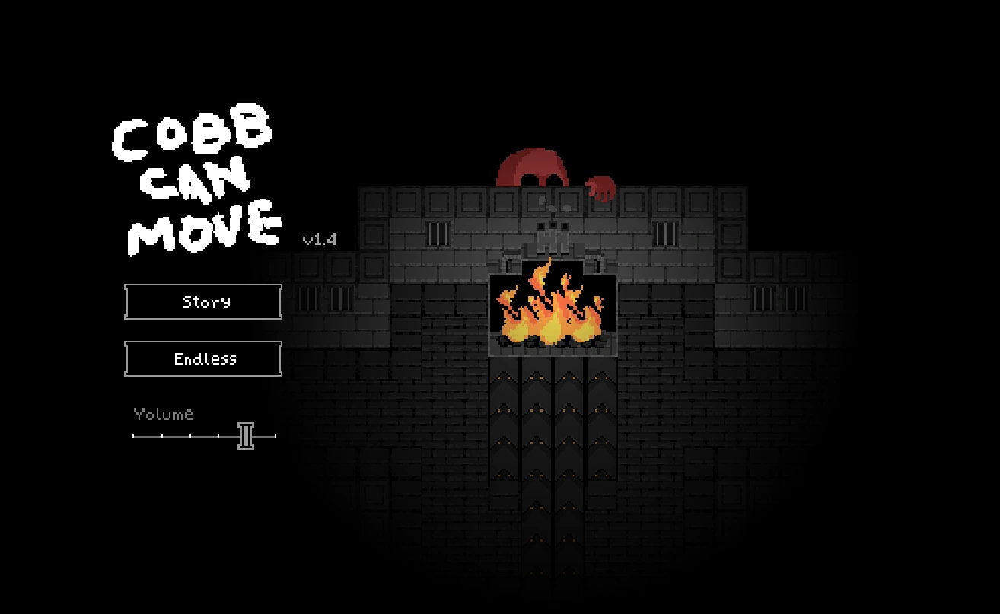
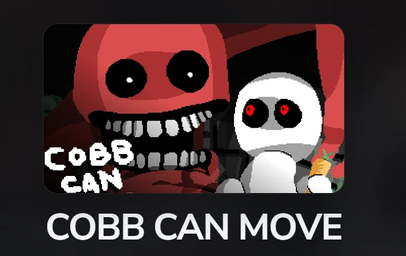
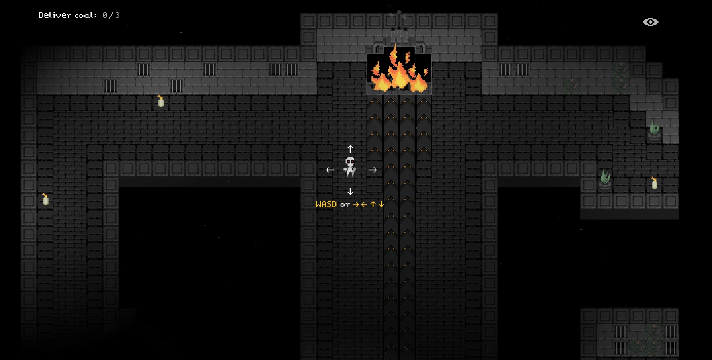
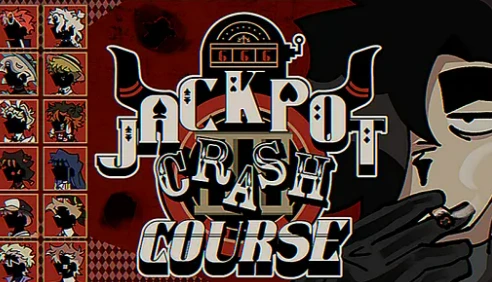

# COBB CAN MOVE Browser Horror Collection

COBB CAN MOVE is a browser survival horror game built around a frightening idea: the rules that protect you do not stay reliable. You move through a dark top-down environment, complete small objectives, listen for danger, and adjust whenever the game teaches Cobb a new way to find you. A route that felt safe during one round can become a trap during the next. The project website places this playable experience at the center, then connects it to a broader collection of unusual horror games, visual novels, interactive stories, and route-driven browser experiences.

## Play Online

- **Official website:** [https://cobb-can-move.net/](https://cobb-can-move.net/)
- **Launch the game:** <a href="https://cobb-can-move.net/" target="_blank" rel="noopener">Play COBB CAN MOVE online</a>
- **Experience:** Survival horror, changing enemy rules, browser play, screenshots, videos, guides, and related games

The live website is the intended way to explore the project. It includes the playable iframe, fullscreen controls, compact related-game cards, a Play More menu, original long-form game introductions, FAQ sections, and stable links to every supported title. This repository contains the generated static files used for deployment.

## Learn How Cobb Changes

The defining feature of COBB CAN MOVE is adaptation. Cobb does not remain one predictable pursuer with one fixed detection rule. Sound, vision, smell, distance, movement, and map knowledge can become more or less important as the game develops. The player must pay attention to what happened during the last failure and decide whether an old route is still worth trusting. This creates a replay loop based on learning rather than random repetition. Losing is frustrating, but it also communicates information that can make the next attempt more deliberate.

The site explains these ideas without replacing discovery with a complete solution. New players receive enough context to understand the controls, the importance of sound, and the value of cautious movement. Returning players can use screenshots and strategy notes to reconsider a difficult round. The page remains focused on play, so guidance appears after the game frame instead of hiding the launch point beneath a long article.

## A Consistent Browser-Game Hub

COBB CAN MOVE is also the visual foundation for a larger game hub. Shared components keep the header, footer, game frame, toolbar, cards, videos, introduction, gallery, quick notes, and FAQ consistent across inner pages. Individual games still receive their own cover, screenshots, iframe, videos, colors, metadata, and original writing. This balance gives visitors a familiar way to navigate without making every game feel identical.

The related-game cards appear beneath the game frame on the homepage and each inner page. They use local cover images, stable paths, descriptive alternative text, and a compact format that remains usable on smaller screens. The Play More menu is generated from the same shared game list, preventing new pages from appearing in one location while being forgotten in another. Sitemap routes are discovered automatically from the application directory.

## Stories Beyond the Main Game

The collection includes horror visual novels, surreal character stories, dating games, psychological experiments, and games where public performance becomes a form of danger. Some entries emphasize dialogue and route choices, while others depend on movement, pattern recognition, or careful observation. Every page is designed to answer practical questions: what the game is, how it plays, whether it works on mobile, what mature themes it contains, and what to check when an iframe remains black.

Videos provide an optional preview or post-play reference. They are embedded with responsive aspect ratios and descriptive titles. Screenshots are placed close to the subjects they illustrate, helping long guides remain readable while also giving visitors a clear sense of the art direction. FAQ schema and game metadata support search visibility without requiring repetitive keyword stuffing.

## Jackpot Crash Course

Jackpot Crash Course adds a casino death-game visual novel to the catalog. Eddie competes under television lights for the possibility of a pardon while rival contestants manage fear, loyalty, reputation, and survival. The page includes direct browser play, screenshots, route discussion, videos, mature-content notes, and an original guide about the way entertainment can turn judgment into spectacle. Its card and Play More link are stored in the same shared data used throughout the site.

## Killer Chat and Character-Driven Horror

Killer Chat represents the collection's character-driven side. Conversation becomes the central mechanic, and danger grows through uncertainty about the person on the other side of the screen. Games like this work well beside COBB CAN MOVE because they use a different control scheme to create the same essential feeling: the player must notice changing rules before those rules become fatal.

## Static Export Workflow

This repository contains the output generated by the Next.js static export. The `npm run build-preserve-git` command builds the site in a temporary project, protects `out/.git`, replaces the deployment files, restores the Git repository, and writes this README from a maintained template. If deployment metadata is missing, the script can seed it from the configured GitHub repository. The README therefore survives every normal build together with the images it references.

Source code should be edited in the main project rather than directly inside `out/`. Generated HTML and assets will be replaced during the next export. For the newest playable pages and complete navigation, visit [cobb-can-move.net](https://cobb-can-move.net/).
